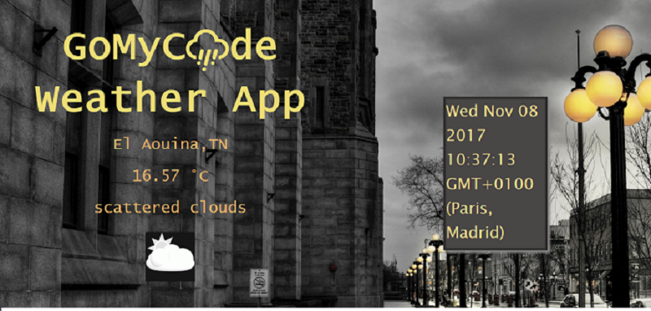

 # local-weather-app 
In this mini-project I have developed a small funny web application that displays weather information, as part of my full stack JavaScript training offered by [GOMYCODE Tunisia](https://www.gomycode.tn)
## Project brief
This is a small web application wich does the following:

<strong>User Story</strong> I can see the weather in my current location.

<strong>User Story</strong> I can see a different icon depending on the weather.

<strong>User story</strong> I can push a button to toggle between Fahrenheit and Celsius.

<strong>User Story</strong> I can see a loading spinner while the application is loading the weather data.

The following screenshot shows my App:

	

To give you more of an idea, have a look at the demo <a href="">here</a>.

## What I have learned

* Use the endpoint: https://fcc-weather-api.glitch.me/ to get the weather at a location.

* Use the geolocation API to get my current position.

* How to use Ajax and JSON to get weather information .

